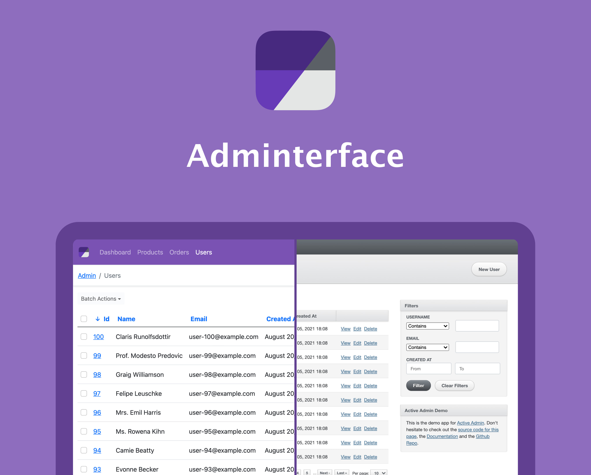

# Adminterface Demo
[](https://github.com/CMDBrew/demo.adminterface.io/actions/workflows/ci.yml)

This is the demo application for the Adminterface gem— https://github.com/CMDBrew/adminterface. Check our [website](https://cmdbrew.github.io/adminterface) to find in-depth documentation for everything that Adminterface offers.

[](https://cmdbrew.github.io/adminterface)

### Installation
1. Clone the repo
2. Install dependencies
  ```bash
  $ bundle install
  $ yarn install
  ```
3. Setup the database
  ```bash
  $ rails db:create
  $ rails db:migrate
  ```
4. Start your server
  ```bash
  $ rails server
  ```
